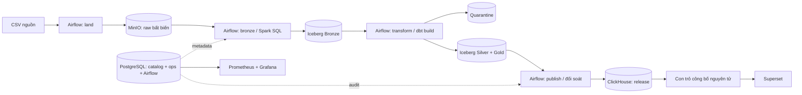

# Cosmetics Commerce Lakehouse

**Một nền tảng ELT có thể truy vết, chạy lại và kiểm soát chất lượng dữ liệu trước khi công bố.**

Dự án phân tích hành vi mua sắm mỹ phẩm từ các sự kiện `view`, `cart`, `remove_from_cart`, `purchase`. Phiên bản 2 tập trung vào tính đúng của dữ liệu và khả năng vận hành: Airflow điều phối, MinIO giữ nguyên dữ liệu gốc, Iceberg lưu các bảng, dbt quản lý SQL và tests, ClickHouse phục vụ dữ liệu đã kiểm tra, Superset trình bày kết quả.

> Đích triển khai: một máy Linux với Docker Compose. Đây là bản triển khai một máy có giới hạn rõ ràng, không phải hệ thống HA. Trạng thái kiểm thử thực tế được ghi ở [validation.md](docs/validation.md); không suy diễn việc có Compose thành đã chạy production thành công.

## Kiến trúc



**ELT ở đây:** Extract file nguồn → Load nguyên byte vào vùng raw → Transform bên trong nền tảng dữ liệu. Tạo Bronze là bước diễn giải cấu trúc sau khi dữ liệu gốc đã được lưu. Airflow truyền định danh giữa các bước; dữ liệu lớn không đi qua XCom.

## Những quyết định kỹ thuật đáng xem

| Bài toán thực tế | Cách xử lý trong dự án |
|---|---|
| Retry sau khi ghi thành công nhưng chưa checkpoint | Raw theo SHA-256; Bronze overwrite nguyên tử đúng partition file |
| Trùng dữ liệu giữa các file | Silver `MERGE` theo khóa sự kiện đã chuẩn hóa |
| Dữ liệu đến muộn | Silver đọc lại nguồn và Gold tính lại toàn bộ, không dùng `max(event_date)` làm watermark |
| Dashboard đọc dữ liệu đang nạp dở | Nạp release ẩn, kiểm tra số dòng + fingerprint, đổi một con trỏ công bố |
| Không có `order_id` | Gọi đúng tên `purchase_events`, không trình bày AOV đơn hàng giả định |
| Hỏng dữ liệu | Quarantine kèm lý do; ngưỡng lỗi toàn bộ và từng file chặn publication |
| Điều tra một lần chạy | Manifest, trạng thái từng bước, thời gian chạy trong `ops`; artifacts dbt trên MinIO |
| Nhiều dự án commerce | Registry cấu hình → một DAG và bộ namespace riêng cho mỗi project |

Đọc [các quyết định kiến trúc](docs/architecture.md) để thấy đánh đổi và giới hạn, thay vì chỉ danh sách công nghệ.

## Chạy trên Linux

Hướng dẫn từng bước cho Linux và Windows/WSL, từ chuẩn bị Docker đến mở dashboard: **[Hướng dẫn chạy dự án](docs/huong_dan_chay.md)**.

Cần Docker Engine + Compose v2.39+, Python 3.11/3.12 và GNU Make. Dự trù **4 vCPU, 16 GiB RAM, 50 GiB SSD trống** cho toàn bộ stack và bộ dữ liệu hiện tại. Core cần khoảng 12 GiB; đây là ngân sách triển khai, chưa phải benchmark. WSL cần bật Docker Desktop integration và cấp đủ RAM.

```bash
# 1. Tạo secrets riêng cho v2; không ghi đè .env cũ
python3 scripts/bootstrap.py

# 2. Đặt file CSV hoàn chỉnh vào data/rawdata/
# Dữ liệu sẵn có của dự án đã ở thư mục này.

# 3. Build và đợi các dịch vụ core sẵn sàng
make up

# 4. Mở Airflow, bật DAG cosmetics_elt rồi Trigger
# Hoặc dùng CLI:
docker compose --env-file .env.deploy exec -T airflow-scheduler airflow dags unpause cosmetics_elt
make trigger

# 5. Sau khi DAG thành công, khởi động dashboard và giám sát
make bi
make monitoring
make status
```

`make demo` tự thực hiện chuỗi khởi động → trigger DAG → chờ kết quả → bật BI/monitoring. Nó dùng các CSV hiện có, **không tự tạo hay thay thế dữ liệu nguồn**. Thời gian chạy full dataset phụ thuộc máy, không cam kết demo trong vài phút.

| Giao diện | URL mặc định | Tài khoản |
|---|---|---|
| Airflow | http://localhost:8080 | `AIRFLOW_ADMIN_USER` / `AIRFLOW_ADMIN_PASSWORD` |
| Superset | http://localhost:8088/superset/dashboard/cosmetics-commerce/ | `SUPERSET_ADMIN_USER` / `SUPERSET_ADMIN_PASSWORD` |
| Grafana | http://localhost:3000 | `admin` / `GRAFANA_ADMIN_PASSWORD` |
| MinIO | http://localhost:9001 | `MINIO_ROOT_USER` / `MINIO_ROOT_PASSWORD` |
| Spark UI | http://localhost:4040 | Chỉ mạng máy chủ |
| Prometheus | http://localhost:9090 | Chỉ mạng máy chủ |

Các mật khẩu được sinh trong `.env.deploy` (quyền `0600`), không có mật khẩu `admin/admin`. Mặc định các port chỉ bind `127.0.0.1`; truy cập VPS bằng SSH tunnel hoặc reverse proxy có TLS. PostgreSQL và Spark Thrift không mở port ra host.

## Dữ liệu và chỉ số

- **Sales:** doanh thu của các purchase event theo ngày UTC, danh mục và brand; giá trị trung bình mỗi purchase event.
- **Funnel:** phiên có view → cart → purchase theo thời gian, kể cả qua nửa đêm; quy về ngày bắt đầu phiên. Không đồng nhất với mọi purchase trong Sales.
- **RFM:** recency theo ngày phân tích, frequency theo phiên mua, monetary theo tổng giá trị purchase. Điểm 5 tốt nhất; trường hợp bằng nhau nhận cùng điểm.
- RFM mặc định dùng ngày sự kiện lớn nhất, phù hợp dataset lịch sử. Có thể truyền `{"as_of_date":"2020-02-29"}` khi Trigger DAG.

Chi tiết về grain, duplicate, null và giới hạn đo lường: [data contract](docs/data_contract.md).

## Kiểm thử và phát triển

```bash
python3 -m venv .venv
.venv/bin/pip install -r requirements-dev.txt -c requirements.lock
python3 scripts/bootstrap.py
make test
.venv/bin/dbt parse --project-dir dbt --profiles-dir dbt

# Kiểm thử Spark/Iceberg thật trên máy phát triển (cần Java 17)
bash scripts/integration.sh
```

CI kiểm tra lint, unit tests, dbt parsing, DAG import và các tình huống Spark/Iceberg. Kiểm thử toàn stack trên Docker cần máy đủ tài nguyên, tách khỏi test nhỏ.

Kiểm tra đường đi dữ liệu bằng container và dữ liệu giả nhỏ (MinIO → Iceberg JDBC → dbt → ClickHouse, có retry, late data, quality gate, recovery và rollback):

```bash
docker compose --env-file .env.deploy build spark-thrift airflow-init
python3 scripts/stack_integration.py
```

Script tạo Compose project riêng, không mở port host và tự xóa volumes kiểm thử khi kết thúc. Logs nằm trong `artifacts/cosmetics_test_*/`. Kiểm thử này gọi pipeline CLI; nghiệm thu lịch Airflow, Superset và toàn bộ dữ liệu vẫn thực hiện bằng `make demo` trên máy đủ RAM.

## Cấu trúc

```text
airflow/dags/       DAG factory, retry, pool, lịch chạy
lakehouse/          landing, Bronze SQL, registry, dbt runner, publication, rollback, metrics
config/            project registry
dbt/               Silver/Gold, quality tests, documentation lineage
spark/             image Spark + Iceberg + Thrift Server
infra/             Airflow image, PostgreSQL roles, ClickHouse read-only user
superset/          image + tự tạo connection/datasets/charts/dashboard
monitoring/        Prometheus rules, Grafana dashboard
scripts/           bootstrap, preflight, deployment, verification, integration tests
tests/             failure/retry tests và Spark integration
```

## Vận hành và mở rộng

- [Runbook: retry, replay, rollback, backup, retention](docs/operations.md)
- [Triển khai, nâng cấp và checklist nghiệm thu](docs/deployment.md)
- [Thêm một dự án khác](docs/extending.md)
- [Kịch bản trình bày tư duy kỹ sư dữ liệu](docs/demo_runbook.md)
- [Kết quả kiểm chứng và phần chưa kiểm chứng](docs/validation.md)
- [Xử lý lỗi thường gặp](docs/troubleshooting.md) và [hướng dẫn dashboard](docs/dashboard.md)

**Giới hạn có chủ đích:** một máy, một slot ghi, full-source scan, chưa có CDC/update/delete theo event ID, raw dùng credential nội bộ cấp platform, alert chưa gửi ra email/Slack. Khi mở ra Internet hoặc triển khai tổ chức nhiều nhóm, cần TLS/SSO, tài khoản MinIO riêng theo quyền, nơi lưu backup bên ngoài và receiver cảnh báo. Multi-project hiện hỗ trợ cùng hợp đồng commerce events; một domain mới vẫn phải có contract và model riêng.

## Tài liệu tham chiếu

Thiết kế dựa trên [Airflow Docker deployment](https://airflow.apache.org/docs/apache-airflow/3.1.7/howto/docker-compose/index.html), [Iceberg JDBC catalog](https://iceberg.apache.org/docs/1.10.0/jdbc/), [dbt Spark materializations](https://docs.getdbt.com/reference/resource-configs/spark-configs) và [ClickHouse EXCHANGE](https://clickhouse.com/docs/sql-reference/statements/exchange). Phiên bản được ghim trong image và dependency constraints; đây không phải tuyên bố tất cả phiên bản là mới nhất.
